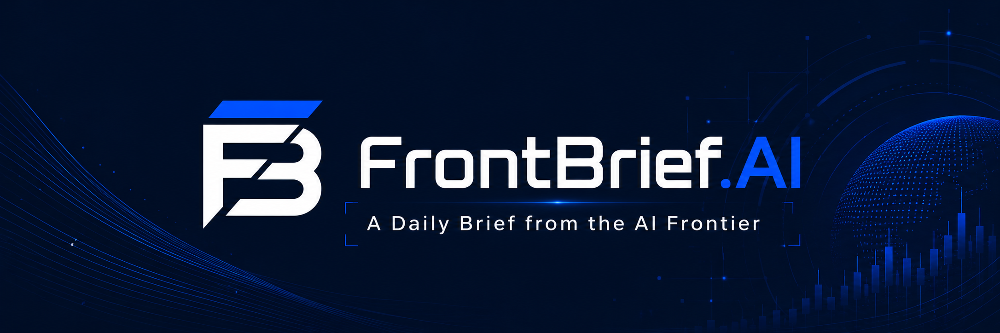
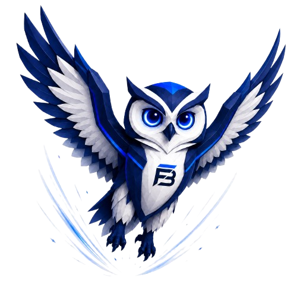
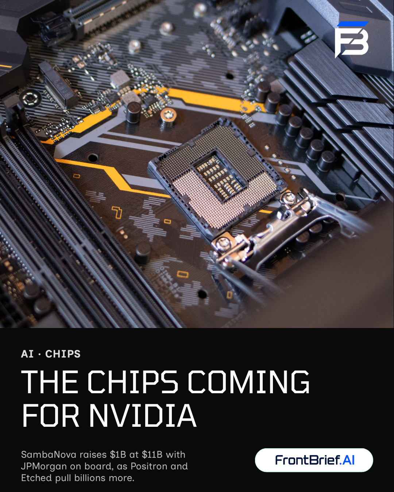
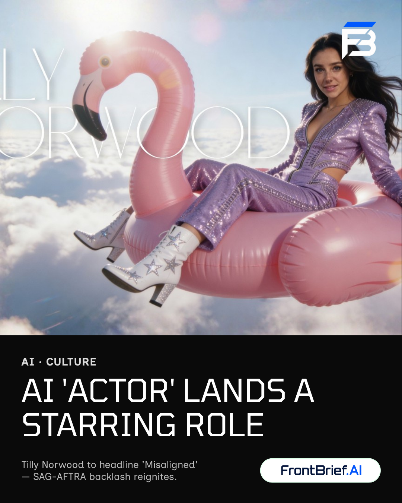
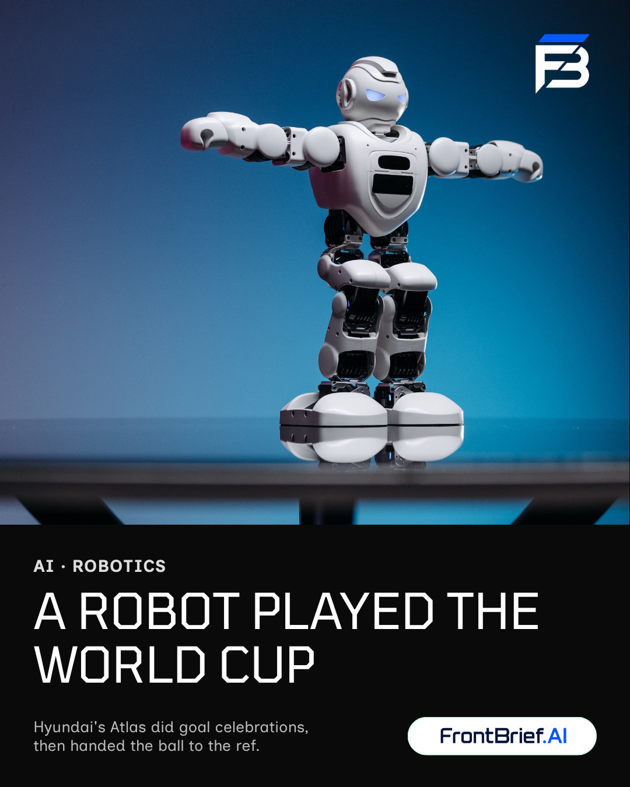
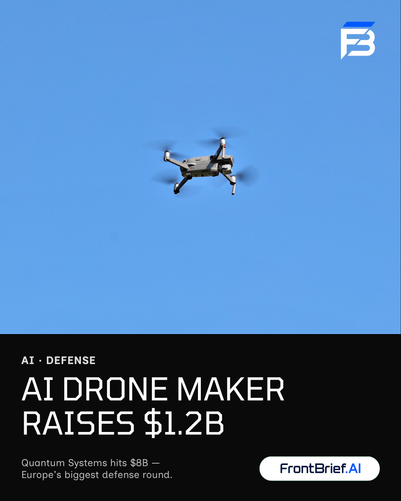
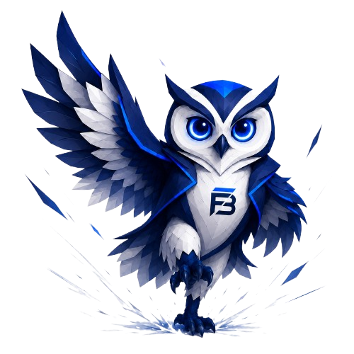

<div align="center">



<h1>FrontBrief.AI</h1>

<p><em>A daily brief from the AI frontier.</em></p>

<p>
An autonomous AI news desk that researches the day's most important AI stories,
writes a sharp 5-item brief, designs a social poster, and ships it to
<strong>the web, LINE, and Instagram</strong> — every morning, hands-free.
</p>

<p>
<a href="https://frontbrief-ai.vercel.app"></a>
</p>

<p>


</p>

</div>

---

## 🦉 Meet the desk

<table>
<tr>
<td width="42%" align="center">

</td>
<td width="58%">

Say hello to the **FrontBrief owl** — the mascot for the desk. Owls watch the night
shift, spot what matters in the dark, and carry the news at first light. That's the
job: while you sleep, the desk reads the AI world and lands a tight, high-signal brief
on your screen by breakfast.

No hype. No filler. Five stories that actually matter, each with a source link and a
plain-English "why it matters."

</td>
</tr>
</table>

---

## What it is

**FrontBrief.AI** is a fully automated, end-to-end AI newsroom built around a daily **Claude
Routine**. Once a day it runs like a small news startup's AI desk:

- 🔎 **Researches** the last 24–48h of high-quality AI sources across four beats
- 🗞️ **Writes** a 5-item brief — importance-first, with an investment angle and a Money Map
- 🎨 **Designs** a matching social poster in Canva, picking the most feed-worthy story
- 📤 **Publishes** to a live website, LINE, and Instagram — automatically

It's built for people who want a concise, high-signal view of the AI world: frontier models,
infrastructure, research, startups, adoption, policy, and selected deeptech angles.

> **Not financial advice.** Every "investment angle" is directional signal only — no price
> targets, no buy/sell calls, no live prices.

---

## The daily poster series

Every brief ships with a poster for the single most *feed-worthy* story of the day (which may
differ from the lead article). A few recent editions:

<table>
<tr>
<td align="center"><br/><sub><b>Chips coming for Nvidia</b></sub></td>
<td align="center"><br/><sub><b>AI 'actor' lands a role</b></sub></td>
<td align="center"><br/><sub><b>A robot played the World Cup</b></sub></td>
<td align="center"><br/><sub><b>AI drone maker raises $1.2B</b></sub></td>
</tr>
</table>

> 30+ posters live in [`social/poster/`](social/poster/) — see [`index.md`](social/poster/index.md) for the full run log.

---

## How it works

```text
Claude Routine — daily 05:00 Europe/London (the Managing Editor)
  ├─ Stage 1  Research pod — 4 parallel beat reporters
  │            (Models & Products · Money & Markets · Deeptech/Research/People · Buzz/Trending)
  ├─ Stage 2  Assignment Editor — dedupes + scores on IMPORTANCE and ENGAGEMENT separately
  ├─ Stage 3  Audience/Social Editor — picks the engagement-first poster story + creative brief
  ├─ Stage 4  Producer/Writer — writes the article, LINE digest, and IG caption
  └─ Stage 5  EIC final pass — QA, builds the Canva poster, updates the ledger, ships
                 ├─ articles/YYYY-MM-DD-ai-brief.md          (brief + LINE digest + web edition)
                 ├─ social/poster/YYYY-MM-DD-ai-brief.png.url (Canva export pointer)
                 └─ social/caption/YYYY-MM-DD-ai-brief.txt    (Instagram caption)

GitHub Actions
  ├─ line-dispatch.yml    article push   → sends the LINE digest
  ├─ commit-poster.yml    .png.url push  → downloads + commits the poster PNG
  └─ post-instagram.yml   after poster   → posts the poster + caption to Instagram

Delivery
  ├─ Website   frontbrief-ai.vercel.app renders the public "Web Edition" of each brief
  ├─ LINE      Official Account delivers the digest to LINE_TO
  └─ Instagram posts the poster with its caption
```

**Claude Routine** handles research, editorial judgement, writing, the poster, the caption, and
committing. **GitHub Actions** handles LINE delivery, the poster PNG commit, and Instagram posting.
The **Next.js website** (in [`web/`](web/)) renders the reader-facing "Web Edition" of every article.

### Two-track selection

The desk runs **two tracks on purpose**:

- **Article / LINE = importance-first** — the five most must-know stories of the day.
- **Poster / Instagram = engagement-first** — the most shareable story, even if it isn't the #1
  article. People & drama, surprises, and strong visuals win the feed.

---

## Brief criteria

The brief picks **exactly 5 items, interestingness-first** — lead with the single most "must-know"
story in AI that day, then rank the rest by importance × how interesting/shareable they are. The
five tracks below are a guide for breadth, **not a quota**; never pad with a weak story to fill a
track.

| Track | Focus |
|-------|-------|
| 🌐 **Global AI / Frontier Models** | Frontier labs, model releases, agents, multimodal, reasoning, safety, regulation, policy |
| 🏗️ **AI Infrastructure / Markets** | NVIDIA, AMD, TSMC, Broadcom, hyperscaler capex, data centres, HBM, energy, inference economics |
| 🔬 **Research / Technical Signal** | Landmark papers and technical releases from high-quality labs, journals, and conferences |
| 🚀 **Product / Startup / Adoption** | Enterprise AI, dev tools, robotics, healthcare, finance, legal AI, funding, M&A, adoption |
| 🧪 **Deeptech Lens** | Surrogate modelling, neural operators, physics GNNs, FEA/CFD acceleration, aerospace, digital twins |

Each item carries an investment angle (signal, not advice) and closes with a **Money Map**. The
desk ignores generic chatbot news, prompt-engineering tips, duplicated stories, vague hype, and
low-signal opinion pieces. **Freshness gate:** nothing older than 5 days; no repeat story or poster
shape within the window.

---

## Repository layout

```text
.github/workflows/line-dispatch.yml      # sends the LINE digest on article push
.github/workflows/commit-poster.yml       # commits the poster PNG from its .png.url pointer
.github/workflows/post-instagram.yml      # posts poster + caption to Instagram
articles/                                 # daily briefs (+ sample-ai-brief.md)
social/poster/                            # daily posters (PNG + .png.url + index.md + ledger.json)
social/caption/                           # daily Instagram captions
web/                                      # Next.js public site (frontbrief-ai.vercel.app)
web/public/mascot/                        # the FrontBrief owl
assets/brand/                             # logo + footer brand assets
docs/claude-routine-prompt.md             # the full editorial prompt the routine runs
scripts/extract_line_digest.py            # pulls the ## LINE Digest section verbatim
scripts/send_line.py                      # sends one LINE message
scripts/post_instagram.py                 # posts the poster + caption
CLAUDE.md                                 # authoritative rules for the routine
requirements.txt
```

---

## Setup

### Required GitHub secrets

Add these under GitHub `Settings` → `Secrets and variables` → `Actions`:

```text
LINE_CHANNEL_ACCESS_TOKEN
LINE_TO                    # user, group, or room ID
INSTAGRAM_USER_ID          # only needed once you enable Instagram auto-posting
INSTAGRAM_ACCESS_TOKEN     # long-lived Instagram Graph API token
```

`LINE_TO` can be a user ID, group ID, or room ID. For a small group of readers, the simplest setup
is to add the LINE Official Account to a LINE group and use the group ID as `LINE_TO`. The two
`INSTAGRAM_*` secrets are optional until you turn on Instagram posting.

### Claude Routine

1. Open `https://claude.ai/code/routines`.
2. Create a new routine and connect this GitHub repository.
3. Schedule it daily at `05:00 Europe/London`.
4. Paste the full prompt from [`docs/claude-routine-prompt.md`](docs/claude-routine-prompt.md) into the Routine Instructions box.
5. Make sure the routine can commit and push to the repository.

When changing the brief criteria, update **both** places: edit `docs/claude-routine-prompt.md` for
version control, and paste the same updated prompt into the Claude Routine Instructions box (the
routine uses the Instructions box at runtime).

### Website

The public site lives in [`web/`](web/) (Next.js 16, deployed on Vercel). It renders the
`## Web Edition` section of each article — the reader-facing narrative — at
**[frontbrief-ai.vercel.app](https://frontbrief-ai.vercel.app)**.

```bash
cd web
npm install
npm run dev        # http://localhost:3000
```

---

## LINE dispatch

`.github/workflows/line-dispatch.yml` runs when a Markdown file under `articles/**/*.md` is pushed
to `main`. It also supports manual `workflow_dispatch` for testing (which uses the newest article,
or the bundled `articles/sample-ai-brief.md`).

`scripts/extract_line_digest.py` sends the hand-written `## LINE Digest` section **verbatim** when
present, and otherwise degrades gracefully by building a digest from the `TL;DR` and `Top 5` links.
`scripts/send_line.py` sends one text message and caps it below 4,500 characters.

**Manual test (from GitHub):** add the `LINE_*` secrets → open `Actions` → select
`LINE Article Dispatch` → `Run workflow` → confirm LINE receives one message.

**Manual test (local):**

```bash
python -m pip install -r requirements.txt
python scripts/extract_line_digest.py
export LINE_CHANNEL_ACCESS_TOKEN="..."
export LINE_TO="..."
python scripts/send_line.py   # sends a real message — inspect reports/latest_line_digest.txt first
```

---

## Article format

Each brief follows the template in [`docs/claude-routine-prompt.md`](docs/claude-routine-prompt.md):

```text
# FrontBrief.AI — YYYY-MM-DD

## LINE Digest     # standalone, punchy; sent to LINE verbatim
## TL;DR           # 3 standalone bullets
## Top 5           # per item: Category / Why interesting / Why it matters /
                   #           Investment angle / Tharm relevance / Action / Link
## Money Map       # where capital + pricing momentum moved
## Watchlist       # three catalysts to monitor next
## Web Edition     # public, journalist-voice narrative (rendered by the website)
```

The `Top 5` is the full evidence trail; each item includes a direct `Link:`. The `Tharm relevance`
and `Action` fields are internal — the website hides them and renders the `## Web Edition`.

---

## Security

Never commit secrets. Store LINE and Instagram credentials only as GitHub Actions repository
secrets. If a token or channel secret is ever pasted into chat, logs, issues, or commits, rotate it
in the provider's console before relying on it.

---

<div align="center">

<br/>
<sub><strong>FrontBrief.AI</strong> — a daily brief from the AI frontier.</sub>
</div>
